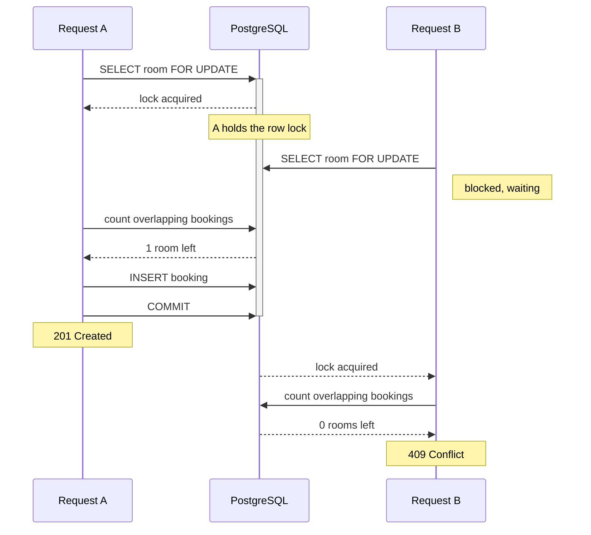

# Hotel Booking API

[](https://github.com/mikke555/booking-app/actions/workflows/ci.yml)

Async REST API for hotel booking, built with FastAPI, SQLAlchemy 2, and PostgreSQL
on Python 3.14.
The focus is on the tricky parts of a booking system: **availability search, concurrent
bookings, and transactions**, all verified by integration tests against a real database.

Interactive API docs (Swagger UI) at `/docs` once running.

## Features

- **Availability search** — hotels and rooms available for the requested dates, with the number of rooms still free
- **Concurrency-safe booking** — a row lock prevents double-booking (see below)
- **JWT authentication** — OAuth2 password flow, Argon2 hashing; timing-safe login to prevent email enumeration
- **Role-based access** — anyone can browse, users create bookings, admins manage the catalogue
- **Integrity at the database level** — check constraints and a composite index on booking dates
- **Pagination** — a consistent `Page[T]` envelope on list endpoints

## Tech Stack

| Area     | Technologies                                      |
| -------- | ------------------------------------------------- |
| API      | FastAPI, Pydantic                                 |
| Database | PostgreSQL, SQLAlchemy 2 (async), Alembic         |
| Auth     | JWT, Argon2                                       |
| Testing  | pytest, pytest-asyncio, HTTPX, coverage           |
| Tooling  | uv, Ruff, Pyright, Docker Compose, GitHub Actions |

## Requirements

- [Docker Desktop](https://www.docker.com/products/docker-desktop)
- For running locally: [uv](https://docs.astral.sh/uv/#installation) and Python 3.14, installed with `uv python install 3.14`

## Configuration

```bash
cp .env.example .env
```

Generate a secret key and paste it into `JWT_KEY` in `.env`:

```bash
uv run python -c "import secrets; print(secrets.token_urlsafe(32))"
```

## Run with Docker

```bash
docker compose up -d
```

This builds the app image, starts PostgreSQL, applies migrations, and serves the API.

To populate the database with demo data, run:

```bash
docker compose run --rm app python -m scripts.seed
```

## Run locally

```bash
uv sync                        # install dependencies
docker compose up -d db        # start PostgreSQL only
uv run alembic upgrade head    # apply migrations
uv run python -m scripts.seed  # seed demo data (optional)
uv run fastapi dev             # run with auto-reload
```

## Architecture

Request flow is **router → service → repository**, with one module per entity
(hotels, rooms, etc.) in each layer:

- **Routers** — HTTP layer: validation, dependencies, response schemas
- **Services** — business rules and domain exceptions
- **`DBManager`** — unit of work: session and transaction boundary
- **Repositories** — database queries; a generic `BaseRepository` covers the common CRUD

Errors are raised as `AppException` subclasses; a global handler turns them into JSON responses with the right status code.

## Availability

Date ranges are half-open, `[date_from, date_to)`, so a guest can check in
on the same day another guest checks out.

Two ranges overlap when:

```sql
booking.date_from < requested.date_to
AND booking.date_to > requested.date_from
```

A room is available while it has fewer overlapping non-cancelled bookings than its `quantity`. Cancelling a booking frees the dates up again.

## Concurrency-safe booking

A booking system must prevent two concurrent requests from reserving the last available room. A simple availability check followed by an insert is vulnerable to a race condition. The application avoids this by acquiring a PostgreSQL row lock for the room before calculating availability:

```python
room = await self.db.rooms.get_by_id(room_id, for_update=True)
```



A dedicated test (`tests/test_concurrency.py`) fires multiple concurrent booking attempts for the last available room and verifies that only one succeeds.

## Testing

Tests run against a separate `booking_test` database, configured via `.env.test`. The database is created automatically by an init script in `docker/initdb/` when the Postgres data volume is first initialized.

Each test runs in a transaction that is rolled back afterwards, so the database stays clean between tests. The concurrency test is the exception: it commits for real, since row locks only block across separate connections.

Run the tests:

```bash
uv run pytest
```

Run the tests under coverage, then print the report:

```bash
uv run coverage run -m pytest
uv run coverage report
uv run coverage html    # htmlcov/index.html
```

The same suite runs in CI on every push, along with formatting, lint, and type checks.

## Development

Format, lint, and type-check:

```bash
uv run ruff format
uv run ruff check
uv run pyright
```

Generate a migration from model changes and apply it:

```bash
uv run alembic revision --autogenerate -m "msg"
uv run alembic upgrade head
```

Useful Docker commands:

```bash
docker compose up -d --build                        # rebuild after code changes
docker compose exec db psql -U postgres -d booking  # open a psql shell
docker compose down -v                              # stop everything and wipe the data
```
